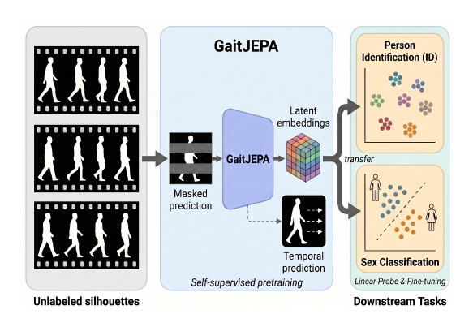

# GaitJEPA

Official repository for the paper:

> **GaitJEPA: How Far Can We Go with JEPA on Binary Silhouettes for Gait Recognition?**

[](https://www.researchgate.net/publication/409847603_GaitJEPA_How_far_can_we_go_with_JEPA_on_binary_silhouettes_for_gait_recognition)

The paper has been accepted for publication at the **2026 IEEE International Joint Conference on Biometrics (IJCB 2026)**.

<p align="center">
  
</p>

## Overview

GaitJEPA studies how far JEPA-style predictive self-supervision can go for gait recognition when the input is restricted to binary silhouette sequences. The model learns from unlabeled walking videos by predicting masked and future latent representations, avoiding identity labels, pixel reconstruction, and contrastive negative pairs during pretraining.

## Highlights

- **Self-supervised gait pretraining from binary silhouettes**, without identity labels, pixel reconstruction, or contrastive negative pairs.
- **JEPA-style predictive learning for gait**, combining masked latent prediction, future-latent dynamics, and latent regularization.
- **Pretrained on GaitLU-1M**, using approximately 1.02M unlabeled walking sequences and more than 90M silhouette frames.
- **Evaluated across CASIA-B, OU-MVLP, and Health&Gait** for low-label person identification and sex classification.
- **Label-efficient initialization**: GaitJEPA improves over training from scratch once a modest amount of labeled downstream data is available.
- **Honest scope**: the pretrained representation organizes viewpoint, walking direction, and temporal progression, but is not claimed as a final identity-discriminative foundation model.

## Selected Results

| Setting | Best observed gain over scratch | Takeaway |
|---|---:|---|
| Health&Gait identification | +18.71 Rank-1 | Strong gains with limited labeled identities |
| CASIA-B identification | +15.20 Rank-1 | Robust improvement under view and condition changes |
| OU-MVLP identification | +13.41 Rank-1 | Benefits emerge with modest supervised adaptation |
| Health&Gait sex classification | +35.27 Balanced Acc. | Strong transfer to soft-biometric prediction |

## Code

The source code, pretrained models, configuration files, and instructions for reproducing the experiments will be made available soon.

Thank you for your interest in our work.

## Citation

```bibtex
@inproceedings{gaitjepa2026,
  title={GaitJEPA: How Far Can We Go with JEPA on Binary Silhouettes for Gait Recognition?},
  author={Marin-Jimenez, Manuel J. and Jimenez-Velasco, Isabel and Muñoz-Salinas, Rafael},
  booktitle={2026 IEEE International Joint Conference on Biometrics (IJCB)},
  year={2026}
}
```
